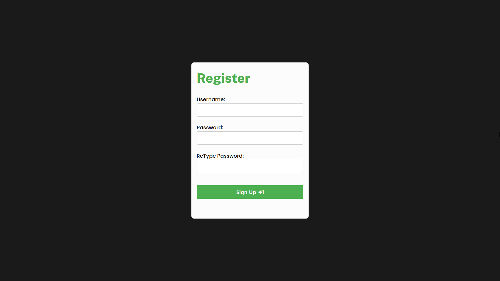
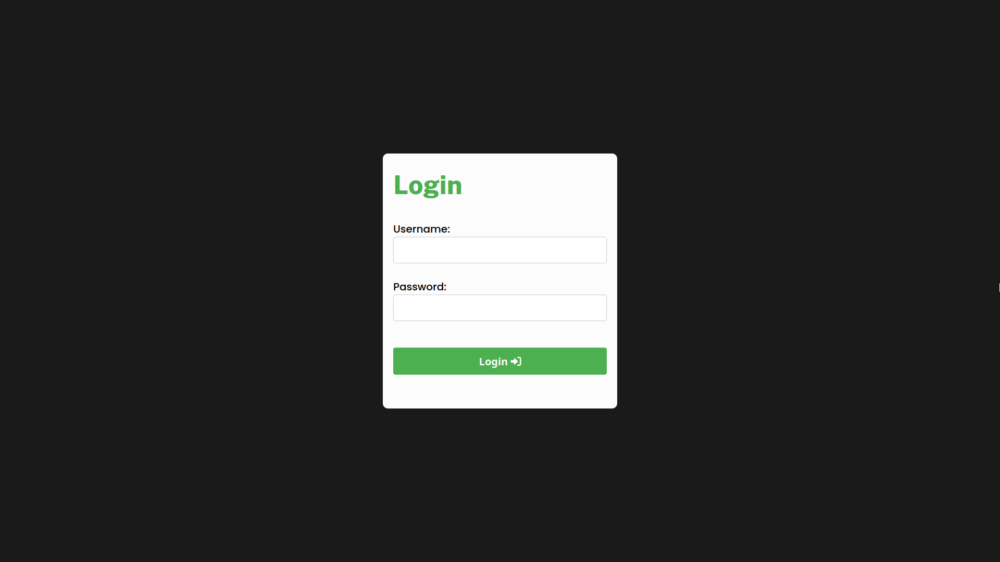
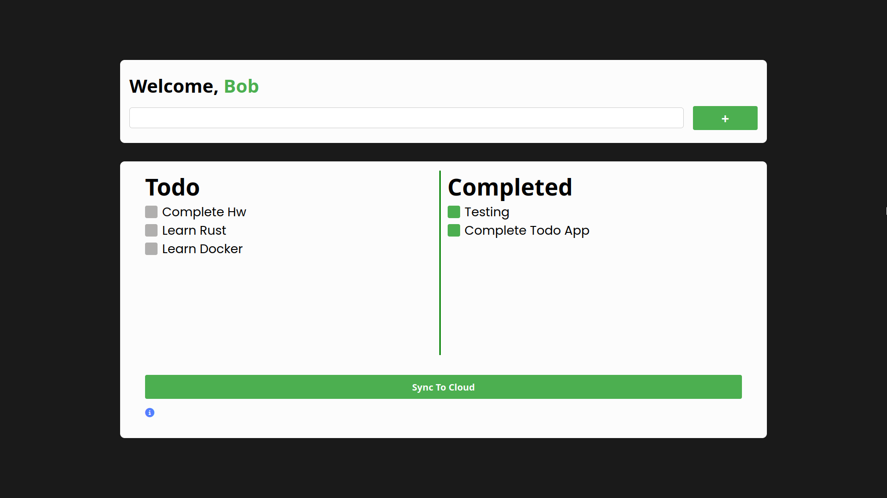

# Todo App using MERN tech stack

In this project, I have created a Todo App using MERN tech stack. This project is a part of my learning process of MERN stack. I hope I will be able to learn more and more about MERN stack :)

## Different routes

1. ``/register`` - Sign-Up page

2. ``/login`` - Login page

3. ``/dashboard`` - Todo page

> It was a fun  project to work on. I am very glad that I was able to complete this project. 